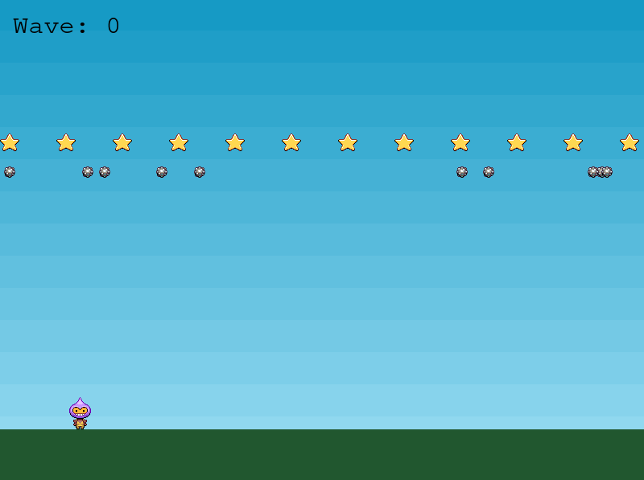
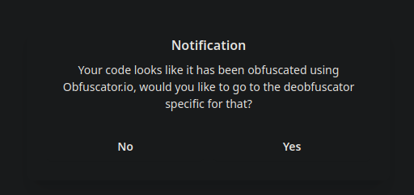

# Phaser-JS (RE, 453 pts, 40 solves)

### Author: `daniao`
### Description:
I followed the phaserjs tutorial and made it a lot harder. Clear 10000000 waves and you will see the flag in the developer console (printed with console.log). Have fun :)

http://challs.nusgreyhats.org:39876

---
## Website
Opening the website, we are met with a minigame where our (apparent) objective is to collect all of the stars while avoiding the bombs.



After collecting all of the stars, the Wave counter increases by 1, and a fresh batch of 12 stars and 10 bombs respawns into the arena. We can't possibly hit 10000000 waves by playing the game in a feasible amount of time. So let's check out the code.

---
## Obfuscated JS

`index.html`:
```html
<head>
    ...
    <script src="js/phaser.min.js"></script>
    <script src="js/game.js"></script>
    ...
</head>
```

Looking at `index.html`, we see `js/game.js` is loaded along with [Phaser JS framework](https://phaser.io/). It seems that Phaser JS is used as the game engine for this game.

`game.js`:
```js
(function (g, f) { const o = xxxf, R = g(); while (!![]) { try { const M = parseInt(o(0xf1)) / (-0x21d6 + 0x1e82 + 0x355) + -parseInt(o(0xf7)) / (0x1921 + -0x1521 * -0x1 + -0x14 * 0x250) * (parseInt(o(0xf0)) / (0x1a95 + 0x293 * -0x6 + -0x2 * 0x590)) + parseInt(o(0xf9)) /* 14434 characters */
```

Opening `game.js`, we find that it is obfuscated. Let's try [searching Google](https://www.lmgt.com/?q=javascript+deobfuscator) for some deobsfucators. Trying to obfuscate the code using [first link](https://deobfuscate.io/), we a met with a message box asking us to goto another website.



Clicking "Yes", we a led to another [deobfuscator](https://obf-io.deobfuscate.io/), which successfully deobfuscates our javascript code.

---
## Simulating `collectStar` method

Unobfuscated code:
```js
class xxxk extends Phaser.Scene {
    /* ... */
    ["create"]() {
        /* ... */
        this.score = 0;
        this.ggwave = 10000000;
        this.hihihaha = [0, 0, 0, 0, 0, 0, 0, 0, 0, 0, 0, 0, 0, 2, 196, 180, 45, 13, 53, 112, 133, 142, 221, 121, 3, 157, 113, 81, 80, 195, 253, 225, 197, 202, 197, 48, 46, 21, 121, 40, 23, 239, 35, 175, 254, 103, 36, 126, 183, 218, 112, 235, 9, 98, 99, 29, 109, 196, 120, 43, 68, 126, 100, 81];
        /* ... */
    }
    /* ... */
    ["collectStar"](g, f) {
        f.disableBody(true, true);
        if (this.stars.countActive(true) === 0) {
            // [1]
            this.score += 1;
            this.scoreText.setText("Wave: " + this.score);
            /* some unimportant code which respawns the bomb and stars */
            let R = this.hihihaha.reduce((S, k) => (S << 0x8n) + BigInt(k), 0x0n);
            let V = BigInt("2933342412243178360246913963653176924656287769470170577218737");
            let u = BigInt("2663862733012296707089609302317500558193537358171126836499053");
            let d = V * u;
            let O = 0x1n;
            for (let S = 0; S < 65537; S++) {
                O = O * R % d;
            }
            for (let k = 0; k < 64; ++k) {
                // [2]
                this.hihihaha[this.hihihaha.length - 1 - k] = Number(O & 0xffn);
                O = O >> 0x8n;
            }
            for (let G = this.hihihaha.length - 1; G >= 24; G--) {
                let h = G * this.score % 40 + 24;
                // [2]
                [this.hihihaha[G], this.hihihaha[h]] = [this.hihihaha[h], this.hihihaha[G]];
            }
            let j = this.score & 255;
            for (let m = 24; m < this.hihihaha.length; ++m) {
                // [2]
                this.hihihaha[m] ^= j;
                j = this.hihihaha[m];
            }
            // [3]
            if (this.score == this.ggwave) {
                let b = this.hihihaha.map(X => String.fromCharCode(X)).join('');
                console.log(b.slice(16)); // only instance of console.log in the source code
            }
        }
    }
}
```

Searching for `console.log` in the source, we find one match in the `collect` method which is called every time a star is collected.

By taking a look at the member variables referenced (`this.<variable>`) in this method, we find that 6 member variables are referenced:
- `this.score` - The score
- `this.ggwave` - After completing this wave, `console.log` is called (which presumably contains the flag)
- [`this.hihihaha`](https://www.youtube.com/watch?v=ZRF2071HZRU) (64 byte array)
- `this.stars` (star game objects)
- `this.bombs` (bomb game objects)
- `this.scoreText` (score text game object?)

If there are no more stars active (`this.stars.countActive(true) === 0`), the code
 - increments `this.score` by 1 [1]
 - updates `this.hihihaha` with some magic algorithm [2]
 - checks if `this.score` is at wave 10 million [3]
	 - if the 10 millionth wave is reached, then print first 16 ASCII chars of `this.hihihaha`

Since we don't know what this magical algorithm that modifies `this.hihihaha` is, we can attempt to run the code within the `if` block 10 million times! After all, my computer can run billions of instructions per second right? 

Isolating the code within the `collectStar` method by
- converting the code to a infinite loop that breaks after 10 million waves
 - removing references to game objects (`this.stars`, `this.bombs`, `this.scoreText`)
 - refactoring `this.<member>` variables and constants (`V`, `u`, `d`) into global variables
 - printing every `100` waves to track progress

We get:
```js
// this.<member> variables
let score = 0;
const hihihaha = [0, 0, 0, 0, 0, 0, 0, 0, 0, 0, 0, 0, 0, 2, 196, 180, 45, 13, 53, 112, 133, 142, 221, 121, 3, 157, 113, 81, 80, 195, 253, 225, 197, 202, 197, 48, 46, 21, 121, 40, 23, 239, 35, 175, 254, 103, 36, 126, 183, 218, 112, 235, 9, 98, 99, 29, 109, 196, 120, 43, 68, 126, 100, 81];

// constants
const V = BigInt("2933342412243178360246913963653176924656287769470170577218737");
const u = BigInt("2663862733012296707089609302317500558193537358171126836499053");
const d = V * u;

// for timing
let last = Date.now()

while (true) {
    score += 1;
    let R = hihihaha.reduce((S, k) => (S << 0x8n) + BigInt(k), 0x0n);
    // removed constants and game object related code

    // [4]
    let O = 0x1n;
    for (let S = 0; S < 65537; S++) {
        O = O * R % d;
    }
    for (let k = 0; k < 64; ++k) {
        hihihaha[hihihaha.length - 1 - k] = Number(O & 0xffn);
        O = O >> 0x8n;
    }
    for (let G = hihihaha.length - 1; G >= 24; G--) {
        let h = G * score % 40 + 24;
        [hihihaha[G], hihihaha[h]] = [hihihaha[h], hihihaha[G]];
    }
    let j = score & 255;
    for (let m = 24; m < hihihaha.length; ++m) {
        hihihaha[m] ^= j;
        j = hihihaha[m];
    }

    // added to measure the time taken to reach 10 million score
    if (score % 100 == 0) {
        let now = Date.now()
        console.log(score, now - last)
        last = now
    }
    
    if (score == 10000000) {
        let b = hihihaha.map(X => String.fromCharCode(X)).join('');
        // print first 16 ASCII chars of hihihaha 
        console.log(b.slice(16));
        break; // exit forever loop
    }
}
```

Let's try to run it in [`node`](https://nodejs.org/en) and see what happens.

```bash
❯ node solve.js 
100 2417
200 2419
300 2401
400 2357
500 2358
600 2360
^C
```

Let's see, it takes around ~2.4 seconds to complete 100 iterations... which means it will take 66.7 hours to complete... ah that's not enough time before the CTF ends! Turns out our powerful computers can't manage this. Let's attempt to optimise it.

Looking at the code, we see 1 `reduce` method call on `hihihaha` and 4 `for` loops. If we take a look at the number of iterations of each loop, we find that the first `for` loop [4] with 65537 iterations, is significantly larger than the rest of loops with lesser than 65 iterations. Let's try optimising this block of code.

---
## Optimising Repeated Multiplication

```js
// [4]
let O = 0x1n;
for (let S = 0; S < 65537; S++) {
	O = O * R % d;
}
```

We find that the `for` loop calculates `R` multiplied by itself `65537` times (mod `d`)... which is simply `R ^ 65537 (mod d)`. Is there a way to speed up repeated multiplication? 

There is a way if you treat it as a [*divide and conquer*](https://en.wikipedia.org/wiki/Divide-and-conquer_algorithm) problem. `x^16`, instead of multiplying `x` by itself 16 times, we can store the *intermediate* results like `x^2`, and multiply those instead.

```js
x2 = x^2
x4 = x2^2
x8 = x4^2
x16 = x8^2
// notice that we only need to compute the square 4 times for x^16! 
```

There's a problem though, what happens if the exponent is not a power of 2? Well, we can just multiply by a single `x` instead.

```js
x12 = x6^2
x6 = x3^2
x3 = x2 * x // if its odd, we multiply by the base once instead of squaring
x2 = x^2
```

With [this method](https://en.wikipedia.org/wiki/Exponentiation_by_squaring), we turned exponentiation of the form `x^n` from `O(n)` problem to `O(log n)` problem. This also works under modulo arithmetic.

With inspiration from a [stack overflow post](https://stackoverflow.com/questions/5989429/pow-and-mod-function-optimization), we can turn this idea into a recursive function:
```js
// note that we have to use suffix `n` to denote that it is a BigInt literal.
// https://stackoverflow.com/questions/5989429/pow-and-mod-function-optimization
function expmod(base, exp, mod) {
    if (exp == 0n) return 1n;
    if (exp % 2n == 0n) {
        // if even, calculate base ^ (exp / 2) first, then square it.
        return (expmod(base, (exp / 2n), mod) ** 2n) % mod;
    } else {
        // if odd, calculate base ^ (exp - 1) and multiply it by base once. 
        return (base * expmod(base, (exp - 1n), mod)) % mod;
    }
}
/* ... */
while (true) {
    /* ... */
    // [4]
    // let O = 0x1n;
    // for (let S = 0; S < 65537; S++) {
    // 	O = O * R % d;
    // }
    let O = expmod(R, 65537n, d);
    /* ... */
    
    // we can now print every 10000 iterations because it is blazingly fast now
    if (score % 10000 == 0) {
    /* ... */
}
```

---
## Running the Optimised Simulation

Running the code, we find that the code takes 120ms to complete 10000 waves, which means our script would only take 120 seconds to complete!

```bash
❯ node solve.js 
10000 122
20000 127
30000 117
40000 117
50000 115
60000 117
(2 min later...)
9950000 110
9960000 110
9970000 109
9980000 110
9990000 110
10000000 110
grey{ea_sports_its_in_the_game_586256cbd58140ec}
```

Yay, we got the flag: `grey{ea_sports_its_in_the_game_586256cbd58140ec}`

---
## Final Code
```js
// note that we have to use suffix `n` to denote that it is a BigInt literal.
// https://stackoverflow.com/questions/5989429/pow-and-mod-function-optimization
function expmod(base, exp, mod) {
    if (exp == 0n) return 1n;
    if (exp % 2n == 0n) {
        // if even, calculate base ^ (exp / 2) first, then square it.
        return (expmod(base, (exp / 2n), mod) ** 2n) % mod;
    } else {
        // if odd, calculate base ^ (exp - 1) and multiply it by base once. 
        return (base * expmod(base, (exp - 1n), mod)) % mod;
    }
}

// this.<member> variables
let score = 0;
const hihihaha = [0, 0, 0, 0, 0, 0, 0, 0, 0, 0, 0, 0, 0, 2, 196, 180, 45, 13, 53, 112, 133, 142, 221, 121, 3, 157, 113, 81, 80, 195, 253, 225, 197, 202, 197, 48, 46, 21, 121, 40, 23, 239, 35, 175, 254, 103, 36, 126, 183, 218, 112, 235, 9, 98, 99, 29, 109, 196, 120, 43, 68, 126, 100, 81];

// constants
const V = BigInt("2933342412243178360246913963653176924656287769470170577218737");
const u = BigInt("2663862733012296707089609302317500558193537358171126836499053");
const d = V * u;

// for timing
let last = Date.now()

while (true) {
    score += 1;
    let R = hihihaha.reduce((S, k) => (S << 0x8n) + BigInt(k), 0x0n);
    // removed constants and game object related code

    // [4]
    // let O = 0x1n;
    // for (let S = 0; S < 65537; S++) {
    // 	O = O * R % d;
    // }
    let O = expmod(R, 65537n, d);
    for (let k = 0; k < 64; ++k) {
        hihihaha[hihihaha.length - 1 - k] = Number(O & 0xffn);
        O = O >> 0x8n;
    }
    for (let G = hihihaha.length - 1; G >= 24; G--) {
        let h = G * score % 40 + 24;
        [hihihaha[G], hihihaha[h]] = [hihihaha[h], hihihaha[G]];
    }
    let j = score & 255;
    for (let m = 24; m < hihihaha.length; ++m) {
        hihihaha[m] ^= j;
        j = hihihaha[m];
    }

    // added to measure the time taken to reach 10 million score
    if (score % 10000 == 0) {
        let now = Date.now()
        console.log(score, now - last)
        last = now
    }

    if (score == 10000000) {
        let b = hihihaha.map(X => String.fromCharCode(X)).join('');
        // print first 16 ASCII chars of hihihaha 
        console.log(b.slice(16));
        break; // exit forever loop
    }
}
```